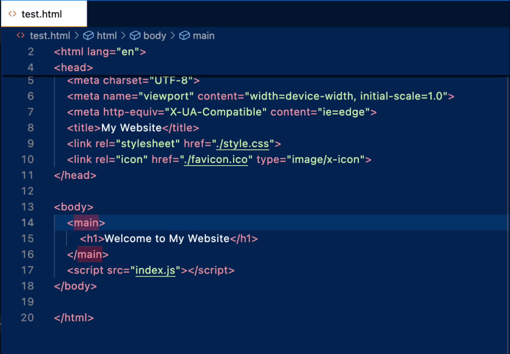

# Tag Toggle

Quickly comment and uncomment HTML tags and their matching closing tags with a single keyboard shortcut. Place your cursor on any opening tag and use `Ctrl+Shift+C` (or `Cmd+Shift+C` on macOS) to comment out the entire tag pair, even with hundreds of lines of content in between.

## Features

The Tag Toggle extension provides intelligent HTML tag commenting that works with both opening and closing tag pairs:

- **Smart Tag Detection**: Automatically finds the matching closing tag for any opening tag, regardless of how many lines are between them
- **Self-Closing Tag Support**: Handles self-closing tags like ``, `<br>`, `<input>`, etc.
- **Toggle Functionality**: Comment out tags with one keystroke, uncomment them with the same keystroke
- **Nested Tag Handling**: Correctly handles nested tags of the same type by tracking tag depth
- **Cursor Position Flexibility**: Works when your cursor is anywhere within the opening tag

<!--  -->

> Place your cursor anywhere within an HTML tag and press `Ctrl+Shift+C` to comment/uncomment the entire tag pair.

### Supported Tag Types

- **Regular HTML tags**: `<div>`, `<span>`, `<p>`, `<section>`, etc.
- **Self-closing tags**: ``, `<br>`, `<hr>`, `<input>`, `<meta>`, `<link>`, etc.
- **Nested tags**: Correctly handles multiple levels of nesting
- **Tags with attributes**: Works with tags containing any number of attributes

## Requirements

- Visual Studio Code version 1.74.0 or higher
- HTML files (the keybinding is currently configured to work only in HTML files)

## Usage

1. Open an HTML file in VS Code
2. Place your cursor anywhere within an HTML opening tag (e.g., within `<div class="container">`)
3. Press `Ctrl+Shift+C` (Windows/Linux) or `Cmd+Shift+C` (macOS)

The extension will:
- Comment out both the opening and closing tags if they're currently uncommented
- Uncomment both tags if they're currently commented

### Example

**Before commenting:**
```html
<div class="container">
    <p>This is some content</p>
    <span>More content here</span>
</div>
```

**After pressing Ctrl+Shift+C with cursor in the div tag:**
```html
<!-- <div class="container"> -->
    <p>This is some content</p>
    <span>More content here</span>
<!-- </div> -->
```

## Extension Settings

This extension contributes the following keybinding:

* `Ctrl+Shift+C` (Windows/Linux) or `Cmd+Shift+C` (macOS): Toggle comment on the HTML tag at cursor position

The keybinding is currently scoped to HTML files only. To use it in other file types, you can modify the keybinding in your VS Code settings.

## Known Issues

- The extension currently only activates for HTML files due to the keybinding scope
- Very complex nested structures with malformed HTML might not be parsed correctly
- Comments that span multiple lines are not currently supported

## Installation

1. Download the extension from the VS Code Marketplace
2. Install it in VS Code
3. Start using it in your HTML files with `Ctrl+Shift+C`

## Contributing

If you encounter any issues or have suggestions for improvements, please feel free to submit an issue or pull request.

## Release Notes

### 0.0.1

Initial release of Tag Toggle extension featuring:
- Basic HTML tag commenting/uncommenting functionality
- Support for self-closing tags
- Nested tag depth tracking
- Keyboard shortcut integration (`Ctrl+Shift+C`)

Future release of Tag Toggle extension goals:
- Add support for additional languages
- Change keybings
---

## For Developers

### Project Structure

```
tag-toggle/
├── extension.js          # Main extension logic
├── package.json         # Extension manifest
├── README.md           # This file
└── images/            # Screenshots and demos (add your images here)
```

### Key Functions

- `findTagAtPosition()` - Locates HTML tags at the cursor position
- `findClosingTag()` - Finds matching closing tags with depth tracking
- `commentOutTag()` - Wraps tags in HTML comments
- `uncommentTag()` - Removes HTML comment wrappers

**Enjoy coding with Tag Toggle!**